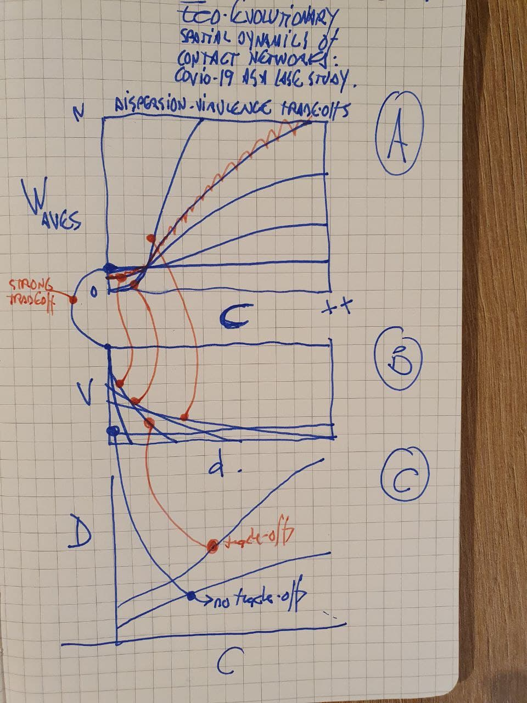

# RobSIRs

A stochastic discrete spatiotemporal model of contact-networks.

## VISION

Modeling mobility dynamics and age-dependent mortality rate at local regional and global scales (NODE: individual, city, and country). Inference includes Susceptibles (S), Infected (I), R (Recovered) and D (Death) types per NODE from dynamic connectivity (C), human density (S), infected (I) and deaths (D) for isolated, fully connected, Connectivity dynamics and empirical mobility rate estimations. 

## QUESTION

How do virulence-dispersion trade-offs along a gradient of connectivity dynamics change the number of infection waves and mortality rates?

## MODELING STRATEGY

eSIRevo: Eco-evo dynamics (trade-offs virulence-dispersion rate plus connectivity rate): 4 parameters Random number --> mutation and virulence rates gradient along dispersal rate --> Proxy as recovery rate --> virulence by matching

## MODELING STRUCTURE

Hierarchical ABM :: Julia Agents.jl or EvoDynamics.jl :

    https://github.com/JuliaDynamics/Agents.jl

    https://github.com/kavir1698/EvoDynamics.jl

    Bayesian Scientist:: Machine scientist -- code in python at https://bitbucket.org/rguimera/machine-scientist

    Keywords:
    
    SIR :: Agent-based, single trait, spatially explicit, evolving interaction trait: virus much higher than humans, age-structured,

    Time-dependent state variables: interaction trait (matching process), susceptibles, infected, recovered

## PRELIMINARY TITLES

    Eco-evolutionary spatial dynamics of contact networks: Covid-19 as a case study.
    Eco-evo dynamics of hot- and cold- urban spots in the human-Covid-19 interaction

## SIR equations per NODE

* $S_{[t]_i} = S_{[t-1]_i} - b(c)\times S_{[t-1]_i} \times I_{[t-1]_i} - m\times S_{[t-1]_{ji}} + m\times S_{[t-1]_{ij}} + s\times R_{[t-1]_i} - ds\times S_{[t-1]_i}$

* $I_{[t]_i} = I_{[t-1]_i} + b(c)\times S_{[t-1]_i} \times I_{[t-1]_i} - a\times I_{[t-1]_i} - m\times I_{[t-1]_{ji}} + m\times I_{[t-1]_{ij}} - dI\times I_{[t-1]_{i}}$

* $R[t]_i = R[t-1]_i + a\times I[t-1]_i - m\times I[t-1]_{ji} + m\times I[t-1]_{ij} - s\times R[t-1]_{i} - dr\times R[t-1]_i$

### Parameters

* b: susceptible to infectious transmission rate  
* c: susceptible to infectious contact rate
* m: migration rate to/from site j 
* r: radius connecting sites i and j : sinusoidal function depending with radius, r, depending on Frequency (f) and Amplitude (w).
* v: virulence rate
* mu: mutation rate (how many mutations to produce a new variant?)
* s: recovered to susceptible rate
* a: infected to recovered rate
* d: death rate (ds, dI, dr)

## Generalization of the equations for an automated simulator builder 

* Process-based knowledge graph to explore populations of models. For example, the SIR equations per NODE described above can be generalized to have Sn nodes for susceptibles (i.e., age classes), In nodes for infected, and Rn nodes for recoverd. In addition, there might be other node types, like explosed, unreported and reported infectious and hospitalized.

## Preliminary discussions (RUN SIMUS)

